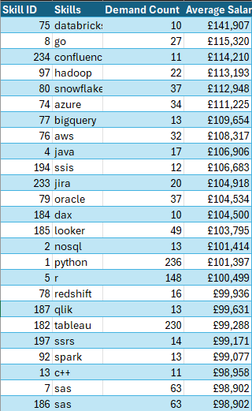

# Intro
A look at the job market with a focus on 'Data Analyst' roles. This project focuses on the top paying jobs, in-demand skills, and the highest paying in demand skills. 

The purpose of this is to identify whether my own skills are in demand, are associated with high paying jobs, or there are additional skills I should focus on to help get started in data analytics.

SQL queries can be found here:
[project_sql folder](/project_sql/)

## Background


Data for this project comes from [add_a_Name](https://www.lukebarousse.com/sql)

The datasets within combine information about job postings, salaries, location, essential skills and more. 
### Questions I wanted to answer
1)	What are the top paying 'Data Analyst' jobs 
2)	What are the skills required for these top-paying roles?
3)	What are the most in-demand skills for my role?
4)	What are the top skills based on salary for my role?
5)	What are the most optimal skills to learn?
(high demand AND high paying)

## Tools I used

For this project I used a range of tools:
- **SQL:**
Utilised coding language SQL to query the database, manipulate the data to uncover answers and transform the dataset to my desires.
- **Postgres:**
This was used for database management, handling the data. 
- **Visual Studio Code:** 
Code editing software that I utilised for all SQL queries and database management.
- **Git & Github:** 
Version control that enabled me to share my SQL scripts and analysis, ensuring accurate tracking and collaboration should anyone wish.
- **PowerBi:**
Software used to create visual representations of the queries and an alternate way to display results for questions 1 and 2.
- **Excel:** Used to collect data from each query and create tables for questions 3, 4 and 5.

## Analysis
Each query was tailored to identify specific aspects of the data to uncover insights and increase the granularity of those insights.

Here's my approach for each question:
#### 1. What are the top paying 'Data Analyst' jobs? 

To identify the highest paying Data Analyst roles I filtered the data analyst positions, focusing on the average yearly salary. To gain further insight I also filtered the location to compare remote jobs with non-remote jobs. Overall, this highlighted the highest paying oppurtunies available. 

``` sql
SELECT 
    job_id,
    job_title,
    job_location,
    job_schedule_type,
    salary_year_avg,
    job_posted_date,
     cd.name AS company_name
FROM job_postings_fact jp
LEFT JOIN company_dim cd
ON jp.company_id = cd.company_id
WHERE job_location = 'Anywhere'
AND salary_year_avg IS NOT NULL
AND job_title_short = 'Data Analyst'
ORDER BY salary_year_avg DESC
LIMIT 10; 
```


--- ADD IN THE FIDNINGS OF THIS CODE AND WHAT HPAPENS AND FORMAT IT
--- breakdown of what happened. top paying job pay range, see where they are. see titles adn specalisation etc


#### 2. What are the skills required for these top-paying roles?

SUMMARY LIKE ABOVE

``` sql
WITH top_paying_jobs AS (
    SELECT 
        job_id,
        job_title,
        salary_year_avg,
        name AS company_name
    FROM 
        job_postings_fact jp
    LEFT JOIN company_dim cd ON jp.company_id = cd.company_id
    WHERE 
        job_title_short = 'Data Analyst' AND
        job_location = 'Anywhere' AND 
        salary_year_avg IS NOT NULL 
    ORDER BY 
        salary_year_avg DESC
    LIMIT 10
)
SELECT 
    tp.*,
    sd.skills
FROM top_paying_jobs tp
INNER JOIN skills_job_dim sj ON tp.job_id = sj.job_id
INNER JOIN skills_dim sd ON sj.skill_id = sd.skill_id
ORDER BY salary_year_avg DESC;
```


NEEDS EXPLANATION

#### 3. What are the most in-demand skills for my role?


``` sql
SELECT 
    sd.skills,
    COUNT(sj.job_id) AS demand    
FROM job_postings_fact jp
INNER JOIN skills_job_dim sj ON jp.job_id = sj.job_id
INNER JOIN skills_dim sd ON sj.skill_id = sd.skill_id
WHERE 
    jp.job_title_short = 'Data Analyst' AND
    jp.job_work_from_home = TRUE
GROUP BY
    sd.skills
ORDER BY
        demand DESC
LIMIT 5;
```


SUMMARY LIKE ABOVE

#### 4. What are the top skills based on salary for my role?


``` sql
SELECT
    sd.skills,
    ROUND(AVG(salary_year_avg), 2) AS avg_salary
FROM job_postings_fact jp
INNER JOIN skills_job_dim sj ON jp.job_id = sj.job_id
INNER JOIN skills_dim sd ON sj.skill_id = sd.skill_id
WHERE 
    job_title_short = 'Data Analyst' AND
    salary_year_avg IS NOT NULL
GROUP BY 
    sd.skills
ORDER BY
    avg_salary DESC
LIMIT 10;
```


SUMMARY LIKE ABOVE

#### 5. What are the most optimal skills to learn?


```sql
SELECT
    sd.skill_id,
    sd.skills,
    COUNT(sj.job_id) AS demand,
    ROUND(AVG(salary_year_avg), 2) AS avg_salary
FROM job_postings_fact jp
  INNER JOIN skills_job_dim sj ON jp.job_id = sj.job_id
  INNER JOIN skills_dim sd ON sj.skill_id = sd.skill_id
WHERE 
    job_title_short = 'Data Analyst' AND
    salary_year_avg IS NOT NULL AND
    job_work_from_home = True
GROUP BY 
        sd.skill_id
HAVING 
    COUNT(sj.job_id) >= 10    
ORDER BY 
    avg_salary DESC,
    demand DESC
LIMIT 25;
```



## What I learned
--- helped solidfy sql, visuals showing a story, story telling of the analysis, bringing it all together


## Conclusions

### Insights
e.g., 
top paying data analyst jobs 
skills for top paying jobs
most in demand skills
skills with higher salaries and what market these are in
optimal skills for job market value (e.g., sql high demand, decent average, often used)

### Closing Thoughts
---- what did it do? helped solidfy my skills, confidence and everything


