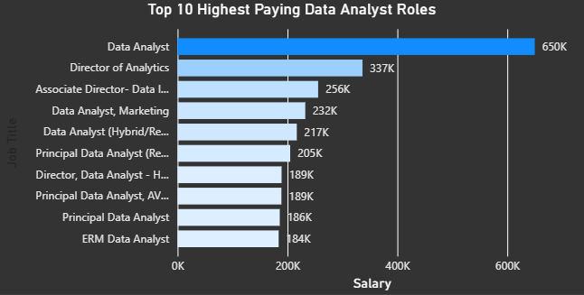
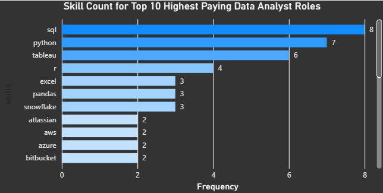
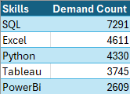
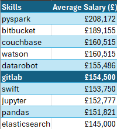

# Intro
A look at the job market with a focus on 'Data Analyst' roles. This project focuses on the top paying jobs, in-demand skills, and the highest paying in demand skills. 

The purpose of this is to identify whether my own skills are in demand, are associated with high paying jobs, or there are additional skills I should focus on to help get started in data analytics.

SQL queries can be found here:
[project_sql folder](/project_sql/)

## Background


Data for this project comes from [This website](https://www.lukebarousse.com/sql)

The datasets within combine information about job postings, salaries, location, essential skills and more. 
### Questions I wanted to answer
1)	What are the top paying 'Data Analyst' jobs 
2)	What are the skills required for these top-paying roles?
3)	What are the most in-demand skills for my role?
4)	What are the top skills based on salary for my role?
5)	What are the most optimal skills to learn?
(high demand AND high paying)

## Tools I used

For this project I used a range of tools:
- **SQL:**
Utilised coding language SQL to query the database, manipulate the data to uncover answers and transform the dataset to my desires.
- **Postgres:**
This was used for database management, handling the data. 
- **Visual Studio Code:** 
Code editing software that I utilised for all SQL queries and database management.
- **Git & Github:** 
Version control that enabled me to share my SQL scripts and analysis, ensuring accurate tracking and collaboration should anyone wish.
- **PowerBi:**
Software used to create visual representations of the queries and an alternate way to display results for questions 1 and 2.
- **Excel:** Used to collect data from each query and create tables for questions 3, 4 and 5.

## Analysis
Each query was tailored to identify specific aspects of the data to uncover insights and increase the granularity of those insights.

Here's my approach for each question:
#### 1. What are the top paying 'Data Analyst' jobs? 

To identify the highest paying Data Analyst roles I filtered the data analyst positions, focusing on the average yearly salary. To gain further insight I also filtered the location to compare remote jobs with non-remote jobs. Overall, this highlighted the highest paying oppurtunies available. 

``` sql
SELECT 
    job_id,
    job_title,
    job_location,
    job_schedule_type,
    salary_year_avg,
    job_posted_date,
     cd.name AS company_name
FROM job_postings_fact jp
LEFT JOIN company_dim cd
ON jp.company_id = cd.company_id
WHERE job_location = 'Anywhere'
AND salary_year_avg IS NOT NULL
AND job_title_short = 'Data Analyst'
ORDER BY salary_year_avg DESC
LIMIT 10; 
```

**Breakdown of the top data analyst roles from 2023 dataset**
- **Salary Range:** The top 10 salaries range from £650,000 to £184,000 indicating sigificant financial options should someone be able to land one of these roles. However, the salary for the top 2 roles (£650,000 and £337,000) are largely ahead of the top 8 suggesting that while these roles are available, they are few and far between and the more likely range for top earning Data Analyst roles is around £256,000 to £184,000.
- **Job Titles:** While there are repeat job titles (Director, Principal Data Analyst and Data Analyst), there is still a variety of roles that make up the highest paying jobs, as well as subcategories of these roles that have the potential for high earning. Interstingly, the highest paying job (£650,000) is simply titled Data Analyst 
- **Companies:** While it is not shown in the bar chart, the query highlights that of the top 10 highest paying roles, each are held by 9 different companies (SmartAsset having 2), indicating that high paying roles are not just for the the biggest companies, although they do also have high paying roles (Meta is in the top 10), and that the skills required for these roles are what open up higher pay       




*Bar graph visualising the top 10 highest paying Data Analyst roles from my dataset; the graph was created in Powerbi from my SQL query results* 


#### 2. What are the skills required for these top-paying roles?

To find the skills associated with the highest paying Data Analyst roles I focused on job titles, the average yearly salary, the associated company and the job ID. I then filtered these to highlight only Data Analyst roles that were remote and had a salary listed. This was then ordered to go from highest to lowest salary and limited to 10 results to get the top 10 highest paying roles. This query was made into a CTE before the associated skills were joined giving me the top 10 highest paying roles and the skills associated with those roles. 

``` sql
WITH top_paying_jobs AS (
    SELECT 
        job_id,
        job_title,
        salary_year_avg,
        name AS company_name
    FROM 
        job_postings_fact jp
    LEFT JOIN company_dim cd ON jp.company_id = cd.company_id
    WHERE 
        job_title_short = 'Data Analyst' AND
        job_location = 'Anywhere' AND 
        salary_year_avg IS NOT NULL 
    ORDER BY 
        salary_year_avg DESC
    LIMIT 10
)
SELECT 
    tp.*,
    sd.skills
FROM top_paying_jobs tp
INNER JOIN skills_job_dim sj ON tp.job_id = sj.job_id
INNER JOIN skills_dim sd ON sj.skill_id = sd.skill_id
ORDER BY salary_year_avg DESC;
```
**Skills breakdown for the top 10 data analyst roles from 2023 dataset:**
- **Top 3 skills:** SQL is the most in demand skill with a count of 8, closely followed by Python with 7 and Tableau at 6. This highlights the most sought after skills and shows Tableau as the most desired specific visual tool (Python similarly can do visuals but is not specifically for that)
- **Other notable skills:** R is the next most desired at 4 followed jointly by Excel, Pandas and Snowflake.  



*Bar chart giving a count of skills associated with the highest paying jobs; this was created in PowerBi by utilising my SQL query.*  

#### 3. What are the most in-demand skills for my role?

The most 'in-demand' skills were classified as the skills that appear the most within job posts. Identifying those that appear highest helps prospective employees hone their skills for desired roles.


``` sql
SELECT 
    sd.skills,
    COUNT(sj.job_id) AS demand    
FROM job_postings_fact jp
INNER JOIN skills_job_dim sj ON jp.job_id = sj.job_id
INNER JOIN skills_dim sd ON sj.skill_id = sd.skill_id
WHERE 
    jp.job_title_short = 'Data Analyst' AND
    jp.job_work_from_home = TRUE
GROUP BY
    sd.skills
ORDER BY
        demand DESC
LIMIT 5;
```
**Most in-demand skills from 2023 dataset:**
- **SQL** is by far the highest in demand skill with **Excel* coming in second and **Python** a close third with visualisation tools **Tableau** and **PowerBi** making up the remainder of the most in-demand skills.
- Interesting, despite **PowerBi** being one of the most in-demand skills, it was not one of the most commonly desired skills in the top 10 highest paying jobs. Furthermore, **Excel** had a low count on the highest paying jobs despite being the second most desired skill. 




*Table of most 'in-demand' skills created in Excel from the above SQL query.*


#### 4. What are the top skills based on salary for my role?

Exploration of the highest salaries based on associated skills giving a finer look into skills associated with the highest paying jobs. 
``` sql
SELECT
    sd.skills,
    ROUND(AVG(salary_year_avg), 2) AS avg_salary
FROM job_postings_fact jp
INNER JOIN skills_job_dim sj ON jp.job_id = sj.job_id
INNER JOIN skills_dim sd ON sj.skill_id = sd.skill_id
WHERE 
    job_title_short = 'Data Analyst' AND
    salary_year_avg IS NOT NULL
GROUP BY 
    sd.skills
ORDER BY
    avg_salary DESC
LIMIT 10;
```
- **Big Data and Machine Learning:** Top salaries are held by those with skills relating to Big Data (PySpark, Couchbase) as well as Machine Learning tools(Juypter, Watson and Datarobot). Skills related to data libraries also command a high salary (Pandas) and highlight the value the industries has placed on data processing and machine learning capabilities.
- **Software Development and Deployment:** There are also high salaries to be found in software creation and development of tools (Gitlab) 



*Table for the average salaries for the top 10 highest paying skills; Table created in Excel using the results of my SQL query*


#### 5. What are the most optimal skills to learn?

Combing the most in-demand skills with highest average salaries to create a query that highlights the most optimal skills for a prospective employee to focus on for job oppurtunities as well as pay. 

```sql
SELECT
    sd.skill_id,
    sd.skills,
    COUNT(sj.job_id) AS demand,
    ROUND(AVG(salary_year_avg), 2) AS avg_salary
FROM job_postings_fact jp
  INNER JOIN skills_job_dim sj ON jp.job_id = sj.job_id
  INNER JOIN skills_dim sd ON sj.skill_id = sd.skill_id
WHERE 
    job_title_short = 'Data Analyst' AND
    salary_year_avg IS NOT NULL AND
    job_work_from_home = True
GROUP BY 
        sd.skill_id
HAVING 
    COUNT(sj.job_id) >= 10    
ORDER BY 
    avg_salary DESC,
    demand DESC
LIMIT 25;
```
- **Highest Demand Programming Languages:** **Python** and **R** stand out as the 2 most in-demand programming languages with respective counts of 236 and 148 for remote job listings. Despite their demand, the average salary for **Python** is:£101,397 and for *R* the average salary is: £100,499. This puts them on the lower end of the skills listed indicating that whilst they are highly in demand, the skills are also likely highly available. 

- **Data Analysis, Modelling & Machine Learning:** Skills relating to machine learning, data analysis, statistics and predictive modeling (Python, SAS, R), all have a significant demand and come with a high average salary, although this is lower than the average salary of some less in-demand skills, and make them good skills to learn for prospective employees.

- **Visualisation:** Tableau has both a high-demand and high-average salary making it a good visualisation tool to pick up in combination with any of the other skills found on this list. 

- **Databases:** While their demand is lower than the above mentioned skills, database skills (NoSQL, Oracle) still have a respectable demand and salary and provide a decent alternative skillset for someone wishing to learn or transition existing skills.


*Table highlighting skills associated with the highest average salaries and number of remote job listings; Table created in Excel utilising the above SQL query.*

## What I learned
- **SQL** Utilised my SQL to gain real insight into the data at several different levels. Questions posed enabled to gain deeper insight into how SQL functions interact with each other within complex queries, solidified my understanding of which JOIN for what scenario and practiced CTEs and subqueries. 
- **VS Code:** Gained significant insight into how to utilise VS Code for project creation, version control, analysis, and it's abilities to sync my work with Github. 

## Conclusions

### Insights
Throughout the analysis, several things became clear:

**Top-Paying Data Analyst Jobs:** Remote Data Analyst roles have quite a range of salaries with the highest hitting £650,000. However, this was significantly higher than the other top jobs which were around £200,000. This highlights the potential for high future earnings at the top, even without it being the highest salary.   

**Top-Paying Skills:** The highest-paying Analyst roles had SQL, Python and Tableau as the most frequently appearing skills indicating that proficiency in any or all of these skills give you the best shot at a high paying job. However, profiency does not guarentee a job nor does it guarentee that there is a demand at the time of looking. 

**Most In-Demand Skills:** SQL is by far the most demanded skill in the data analyst job market and is a must have for job seekers. That being said, Python and Excel were both significantly in demand, although less than SQL and therefore may be an alternate avenue for Data Analyst roles should an individual wish to learn something other than SQL. Alternatively, learning 2 of the top 3 or all 3 puts candiates at the best chance as they will have procifiency in the most in-demand skills. 

**Skills with Higher Salaries:** 
-  **Top Salaries:** these are generally held by those with skills relating to Big Data (PySpark, Couchbase) as well as Machine Learning tools (Juypter, Watson and Datarobot). Skills related to data libraries also command a high salary (Pandas) and highlight the value the industries has placed on data processing and machine learning capabilities.

**Optimal Skills:** 

The most optimal skills highly depend on personal preference but there are quite a few good options depending on the person:

- **Python** and **R:** These skills are highly desirable in the market and provide a high average salary making them a good skill for anyone interested in working on data analysis, predictive modeling and machine learning. However, due to high-demand and salary, it is safe to assume that individuals with these skills are more prevalent, potentially making it harder to get into. 

- **Tableau:** For individuals wishing to levelerage visualisation in their worklife, Tableau is a great option as it has both a high demand and a high average salary (£99,288). Alternatively, PowerBi also has a high demand but lower average salary. 

- **NoSQL** and **Oracle:** While the demand for these roles is lower, they still have a respectable average salary (£101,414 and £104,534 respectively) and provide an alternative skill for those wishing to work with databases.

### Closing Thoughts
This project enabled me to solidify my SQL skills and gain deeper understanding of how functions interact with each other in complex queries, different ways to approach problems and that there are different ways for the same questions but what is important is how you present query and explain the answer. 

It also provided me with significant experience in utilising VS Code for project storage, version control and documentation along with the ability to cleanly document my project on Github and how to tell a story with the answers gained from the data. 

The data itself helped me to understand what employers are looking for when it comes to data analyst roles and allowed me to focus my efforts into skills that I want to develop while simultaneously knowing that these skills are widely desirable and have the potential for high earnings. This exploration highlights the importance of continual learning but also learning skills that are applicable to many jobs, not just a few niche skills.

